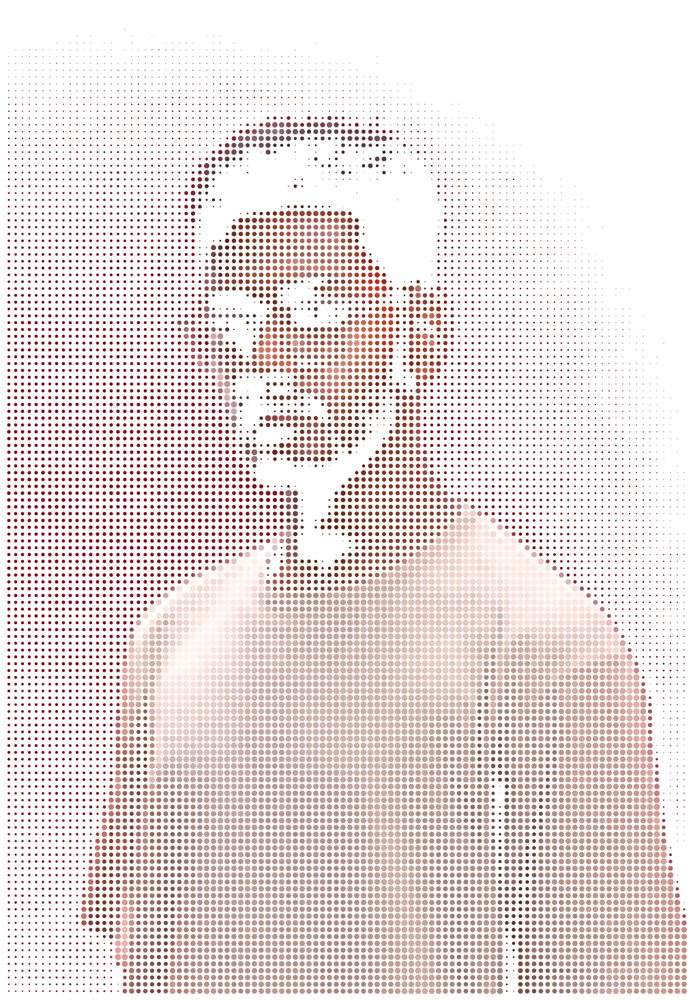
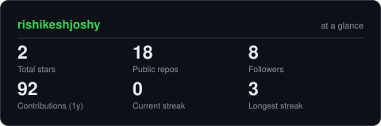

 

 

 

---

## 01 — what I build

I build **agentic systems** — supervisor architectures where a coordinating agent
routes work to subagents that each own a narrow job. Most of my work sits at the
seam where those systems meet a product someone actually has to use: a mobile app,
a booking flow, a payment gateway.

Right now that means shipping a turf booking and tournament platform end to end,
as the only developer on it.

**Currently** &nbsp;·&nbsp; Software Developer at Leno Sports — Flutter + Next.js + Supabase, sole dev
**Focus** &nbsp;·&nbsp; Multi-agent orchestration with LangGraph and Google ADK
**Also** &nbsp;·&nbsp; Red Services — my freelance development and design studio
**Off-screen** &nbsp;·&nbsp; I shoot food, fashion and MMA. Ringside teaches you more about latency than any dashboard.

Final-year Computer Engineering · Pillai College of Engineering, New Panvel · Mumbai

---

## 02 — stack

**Agentic** LangGraph · Google ADK · Gemini · LlamaIndex · Pinecone &nbsp;&nbsp;|&nbsp;&nbsp;
**ML** TensorFlow · TFLite · OpenCV &nbsp;&nbsp;|&nbsp;&nbsp;
**Automation** n8n

Listed because I'd take a question on any of them. Nothing here is from a tutorial I did once.

---

## 03 — self-assessment, and the audit

<table>
<tr>
<td width="50%" align="center" valign="middle">

<picture>
  <source media="(prefers-color-scheme: dark)"  srcset="assets/radar-dark.svg">
  <source media="(prefers-color-scheme: light)" srcset="assets/radar-light.svg">
  
</picture>

what I claim

</td>
<td width="50%" align="center" valign="middle">

<picture>
  <source media="(prefers-color-scheme: dark)"  srcset="assets/radar-langs-dark.svg">
  <source media="(prefers-color-scheme: light)" srcset="assets/radar-langs-light.svg">
  
</picture>

what my public repos actually contain

</td>
</tr>
</table>

The right-hand chart only sees public code. Most of what I ship is client work under NDA, so it undercounts — that's a limitation of the chart, not a claim about the work.

---

## 04 — activity

  

<picture>
  <source media="(prefers-color-scheme: dark)"  srcset="https://raw.githubusercontent.com/rishikeshjoshy/rishikeshjoshy/output/snake-dark.svg">
  <source media="(prefers-color-scheme: light)" srcset="https://raw.githubusercontent.com/rishikeshjoshy/rishikeshjoshy/output/snake.svg">
  
</picture>

  

<picture>
  <source media="(prefers-color-scheme: dark)"  srcset="assets/card-stats-dark.svg">
  <source media="(prefers-color-scheme: light)" srcset="assets/card-stats-light.svg">
  
</picture>

---

## 05 — selected work

Most of this is private — client repos and an employer codebase. Descriptions instead of links, because a card pointing at a 404 helps nobody.

 

**Leno Sports Platform** — private
Turf booking and tournament platform. Sole developer. Per-venue Razorpay configuration
rather than separate merchant accounts, DigiLocker scoped to player registration only,
hashed document deletion for compliance.
`Flutter` `Next.js` `Supabase RLS` `Razorpay` `Setu DigiLocker` `n8n`

**EVJourney** — academic, team of three
Multi-agent EV trip planner. I owned the agentic backend: a LangGraph supervisor
routing to three subagents over a shared state schema.
`LangGraph` `Google ADK` `Gemini` `Flutter`

**Portfolio** — [rishikeshkanikudiyil.vercel.app](https://rishikeshkanikudiyil.vercel.app)
Single-file brutalist build. No framework, no dependencies.
`HTML` `CSS` `GSAP` `Lenis`

---

Open to Agentic AI and full-stack engineering roles · <a href="mailto:rishikeshjoshy@gmail.com">rishikeshjoshy@gmail.com</a>

